# PHÂN ĐOẠN TÍN HIỆU THÀNH TIẾNG NÓI VÀ KHOẢNG LẶNG

**Báo cáo giải thích chi tiết bằng tiếng Việt - Học phần Xử lý tín hiệu số**  
**Thành viên nhóm:** `[Họ tên - MSSV]`, `[Họ tên - MSSV]`, `[Họ tên - MSSV]`

## 1. Bài toán đang giải quyết là gì?

Chương trình trong bài này **không nhận dạng nội dung câu nói**, không chuyển giọng nói thành văn bản và cũng không nhận diện người nói. Nhiệm vụ duy nhất là phân đoạn một file âm thanh thành hai trạng thái:

- `speech`: đang có tiếng nói, bao gồm cả âm hữu thanh (`v`) và âm vô thanh (`uv`);
- `silence`: khoảng lặng (`sil`).

Đầu vào là toàn bộ một file WAV. Đầu ra chính là hai mốc thời gian: thời điểm tiếng nói bắt đầu và thời điểm tiếng nói kết thúc. Ví dụ, với `phone_F2.wav`, file kéo dài khoảng 4.8 giây nhưng vùng tiếng nói chuẩn chỉ từ 1.02 s đến 4.04 s. Vì vậy kết quả mong muốn có dạng:

```text
0.00 s -------- 1.02 s ================= 4.04 s -------- 4.80 s
     silence                 speech                 silence
```

Mỗi notebook chạy bốn file kiểm thử nên xuất bốn hình. **Một hình là toàn bộ một file âm thanh**, không phải bốn đoạn cắt từ cùng một file và cũng không phải video.

## 2. Đề bài của giảng viên yêu cầu những gì?

Các yêu cầu chính được rút ra từ tài liệu đề và hướng dẫn trình bày:

1. Dùng các file trong `TinHieuHuanLuyen` để xác định tham số hoặc ngưỡng.
2. Chỉ dùng bốn file trong `TinHieuKiemThu` để báo cáo kết quả cuối cùng.
3. Cài đặt ba nhiệm vụ TT1, TT2 và TT3.
4. Vẽ waveform và đặc trưng STE hoặc log-STE trên mỗi tín hiệu.
5. Vẽ biên chuẩn từ file LAB và biên do thuật toán tự tìm được.
6. Tính MAE hoặc RMSE giữa hai bộ biên, đơn vị millisecond.
7. Một lần chạy phải xử lý đủ bốn file test và tạo bốn figure.
8. Khoảng lặng thật phải dài tối thiểu 200 ms; khoảng lặng ngắn hơn bên trong tiếng nói được xem là khoảng lặng giả.
9. TT3 phải thống kê mean và standard deviation của STE cho speech và silence từ dữ liệu training, sau đó xây dựng ngưỡng dựa trên giả thiết Gaussian.

Trong cấu trúc hiện tại:

| File | Ý nghĩa |
|---|---|
| `TT1/1.ipynb` | TT1 cơ bản theo yêu cầu thầy: ngưỡng STE và binary search |
| `TT2/1.ipynb` | TT2 cơ bản theo yêu cầu thầy: histogram STE |
| `TT3/1.ipynb` | TT3 cơ bản theo yêu cầu thầy: hai phân bố Gaussian |
| Các file `2.ipynb` | Thí nghiệm mở rộng của nhóm, không thay thế phần cơ bản |

## 3. Dữ liệu WAV và LAB

Mỗi file WAV có một file LAB cùng tên. LAB mô tả từng đoạn thời gian bằng ba nhãn:

- `sil`: silence, tức khoảng lặng;
- `v`: voiced, tức âm hữu thanh;
- `uv`: unvoiced, tức âm vô thanh.

Ví dụ:

```text
0.00    0.53    sil
0.53    1.05    v
1.05    1.12    uv
```

Điều này có nghĩa là 0.00-0.53 s là khoảng lặng, 0.53-1.05 s là âm hữu thanh và 1.05-1.12 s là âm vô thanh. Trong bài toán VAD nhị phân, cả `v` và `uv` đều phải được giữ lại là speech.

| Tập dữ liệu | Các file | Mục đích |
|---|---|---|
| Training | `phone_F1`, `phone_M1`, `studio_F1`, `studio_M1` | Học ngưỡng và tham số |
| Validation | Giữ riêng `studio_M1` trong giai đoạn chọn mô hình | Kiểm tra cách làm mà chưa dùng test |
| Test | `phone_F2`, `phone_M2`, `studio_F2`, `studio_M2` | Đánh giá cuối cùng |

Việc chia validation theo **nguyên file** quan trọng hơn chia ngẫu nhiên từng frame. Các frame sát nhau trong cùng một câu nói rất giống nhau; nếu trộn chúng sang cả train và validation thì số đo validation sẽ tốt giả tạo.

## 4. Tại sao phải chia tín hiệu thành frame?

Âm thanh là một chuỗi mẫu rất dài. Năng lượng và tần số của tiếng nói thay đổi theo thời gian nên không thể dùng một giá trị duy nhất cho cả file. Ta chia tín hiệu thành các cửa sổ ngắn gọi là frame:

- độ dài frame: 20 ms;
- bước dịch giữa hai frame: 10 ms;
- hai frame liên tiếp chồng lấp 10 ms.

Trong khoảng 20 ms, tiếng nói có thể xem là gần dừng. Do hop bằng 10 ms, vị trí biên đầu ra thay đổi theo bước xấp xỉ 10 ms. Đây là lý do sai số từng biên thường là 0, 10, 20 hoặc 30 ms. MAE trung bình có thể bằng 5 hoặc 6.25 ms vì ta lấy trung bình nhiều biên, nhưng điều đó không có nghĩa độ phân giải thời gian thật là 2-5 ms.

## 5. STE là gì?

STE là viết tắt của **Short-Time Energy**, tức năng lượng ngắn hạn. Với frame thứ `m` gồm `N` mẫu, STE được tính bằng:

$$
E[m] = (1/N) * sum(x_m[n]^2)
$$

Bình phương làm cho mẫu âm và mẫu dương đều đóng góp năng lượng. Lấy trung bình giúp giá trị ít phụ thuộc vào số mẫu trong frame.

Trong notebook, STE được chuẩn hóa theo giá trị lớn nhất của từng file:

$$
E_norm[m] = E[m] / max(E[k])
$$

Sau chuẩn hóa, STE nằm gần khoảng 0-1:

- STE gần 0: thường là silence hoặc nhiễu nền yếu;
- STE lớn: thường là phần voiced có biên độ mạnh;
- STE trung gian: có thể là unvoiced, âm cuối yếu hoặc nhiễu.

STE là đặc trưng phù hợp cho VAD vì khoảng lặng và phần hữu thanh thường khác nhau rõ về năng lượng. Tuy nhiên, STE không hoàn hảo vì âm vô thanh có thể mang năng lượng thấp gần giống silence.

## 6. Âm hữu thanh và âm vô thanh

### 6.1 Âm hữu thanh - voiced

Âm hữu thanh được tạo ra khi dây thanh dao động gần tuần hoàn. Ví dụ thường gặp là các nguyên âm và nhiều phụ âm hữu thanh. Đặc điểm:

- waveform có tính tuần hoàn tương đối;
- thường có năng lượng lớn;
- tồn tại tần số cơ bản F0;
- ZCR thường thấp hơn âm vô thanh.

### 6.2 Âm vô thanh - unvoiced

Âm vô thanh được tạo ra bởi luồng khí và nhiễu rối, không có dao động dây thanh tuần hoàn rõ. Ví dụ có thể gặp ở /s/, /f/, /t/, /k/. Đặc điểm:

- năng lượng có thể yếu;
- waveform giống nhiễu hơn;
- F0 không ổn định hoặc không tồn tại;
- thường có nhiều năng lượng cao tần;
- ZCR thường cao.

Điểm khó của bài toán là **không được xóa âm vô thanh**. Nếu chỉ đặt ngưỡng STE quá cao, các phụ âm yếu ở đầu hoặc cuối câu sẽ bị xem là silence và biên speech bị cắt vào trong.

## 7. F0, ZCR và bộ lọc pre-emphasis

### 7.1 F0 là gì?

F0 là tần số cơ bản của dao động dây thanh. Notebook ước lượng F0 bằng tự tương quan từng frame. Khi waveform có chu kỳ rõ, vị trí cực đại tự tương quan cho phép suy ra chu kỳ và F0.

Trong bài này, F0 **chỉ dùng để minh họa** phần voiced trên hình. Nó không tham gia tìm biên speech. Nếu dùng F0 làm điều kiện bắt buộc, thuật toán sẽ loại nhầm âm vô thanh vì unvoiced vốn không có F0 ổn định.

### 7.2 ZCR là gì?

ZCR là Zero-Crossing Rate, tỷ lệ số lần tín hiệu đổi dấu trong một frame. Tín hiệu thay đổi nhanh hoặc giàu cao tần thường có ZCR lớn. Vì vậy ZCR có thể hỗ trợ phát hiện âm vô thanh mà STE bỏ sót.

Tuy nhiên, nhiễu nền yếu cũng có thể có ZCR cao. Do đó không thể chỉ dùng ZCR; nó phải kết hợp với năng lượng hoặc một energy floor.

### 7.3 Pre-emphasis FIR

Bộ lọc được dùng trong phần mở rộng có kernel:

$$
h[n] = [1, -0.97]
$$

Tương đương phương trình:

$$
y[n] = x[n] - 0.97*x[n-1]
$$

Đây là bộ lọc FIR bậc một. Nó giảm sự chi phối của thành phần biến thiên chậm/tần số thấp và làm nổi bật thay đổi nhanh/tần số cao. Vì âm vô thanh thường giàu thành phần cao tần, năng lượng sau pre-emphasis cung cấp thêm thông tin cho mô hình.

Bộ lọc này không phải bộ lọc “xóa hết nhiễu”. Mục đích của nó là thay đổi phổ để một số đặc điểm của unvoiced dễ quan sát hơn.

## 8. Quy tắc khoảng lặng tối thiểu 200 ms

Sau khi áp ngưỡng, chuỗi quyết định có thể xuất hiện một đoạn 0 ngắn giữa nhiều frame speech:

```text
1111111111 00000 1111111111
```

Với hop 10 ms, năm frame 0 chỉ tương ứng khoảng 50 ms. Theo đề, khoảng lặng thật phải dài ít nhất 200 ms, tức khoảng 20 hop. Vì vậy đoạn 0 ngắn này được nối lại thành speech:

```text
1111111111 11111 1111111111
```

Đây là bước hậu xử lý quan trọng. Nó ngăn các đoạn năng lượng yếu rất ngắn bên trong câu nói làm tín hiệu bị chia vụn.

## 9. TT1 - ngưỡng năng lượng và binary search

### 9.1 TT1 cơ bản - `TT1/1.ipynb`

TT1 dùng một ngưỡng STE chung. Mỗi frame được quyết định như sau:

```text
STE_norm >= threshold  -> speech
STE_norm < threshold   -> silence
```

Ngưỡng quá thấp sẽ nhận nhiễu nền thành speech. Ngưỡng quá cao sẽ cắt mất âm vô thanh. Binary search thử các ngưỡng trên dữ liệu training và thu hẹp dần khoảng tìm kiếm để chọn ngưỡng có sai số biên nhỏ.

Pipeline TT1:

```text
WAV -> frame -> normalized STE -> binary-search threshold
    -> speech/silence -> bridge silence < 200 ms -> start/end
```

### 9.2 TT1 mở rộng - `TT1/2.ipynb`

Phần mở rộng kết hợp bốn đặc trưng: log-STE, năng lượng sau pre-emphasis, ZCR và tỷ lệ năng lượng trên 3 kHz. Một logistic classifier nhỏ tự học trọng số bằng gradient descent. Notebook lưu loss theo epoch để nhìn thấy quá trình tối ưu.

Mục tiêu không phải dùng mô hình AI lớn mà là kết hợp nhiều dấu hiệu DSP trong một quyết định tuyến tính có thể giải thích.


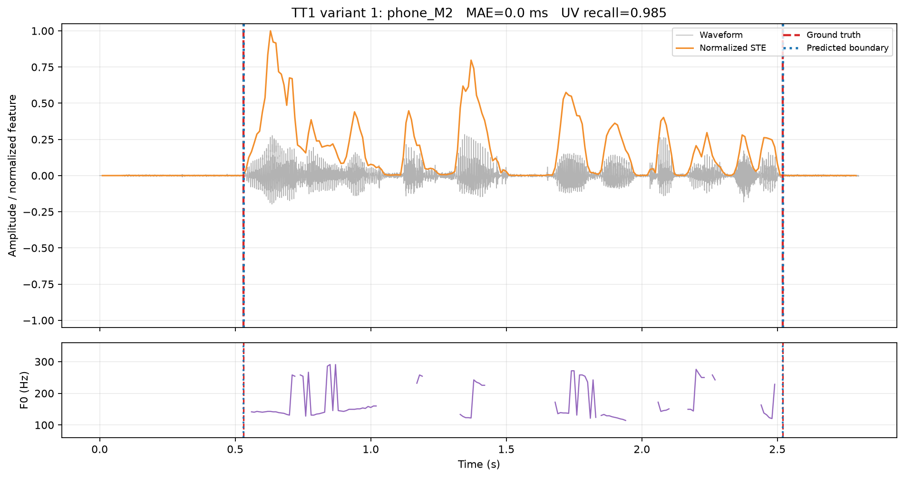


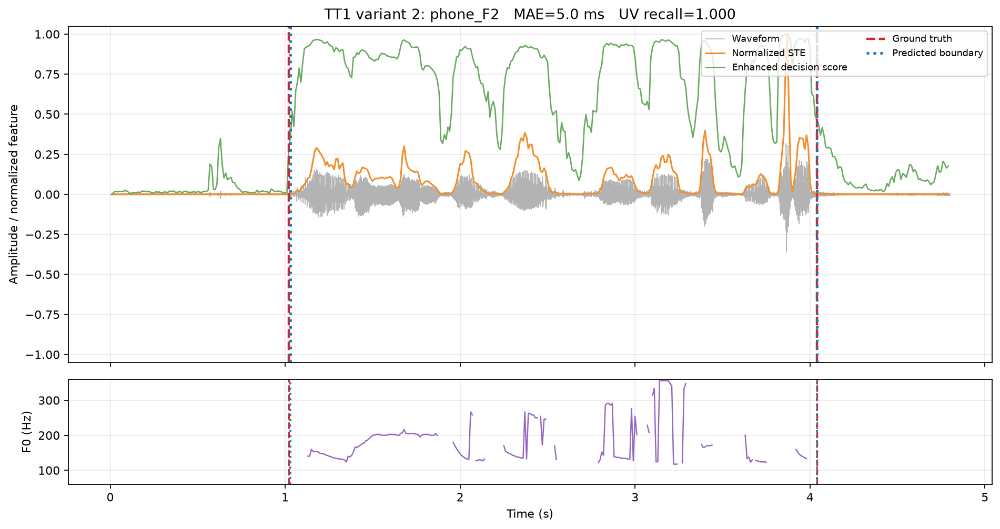
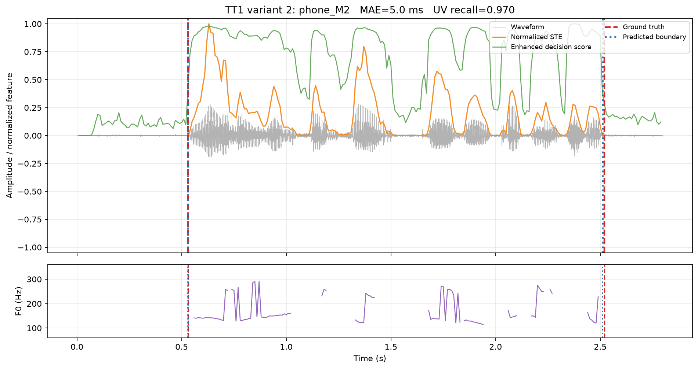
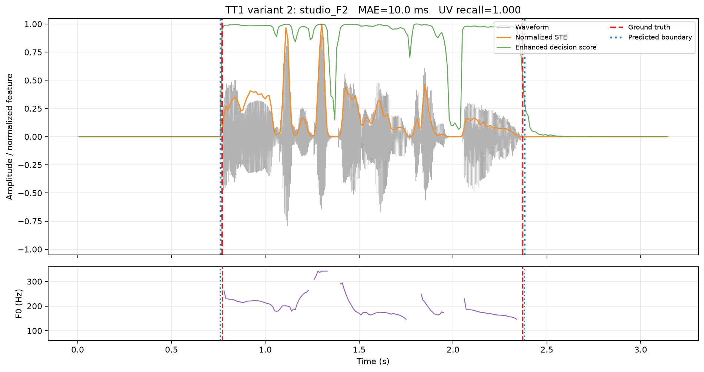
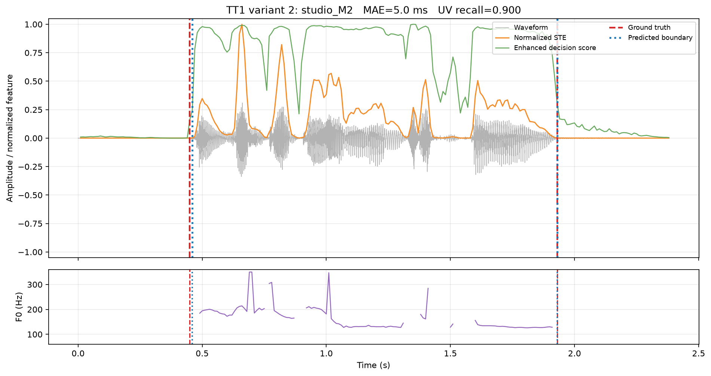

TT1 mở rộng là kết quả tốt nhất hiện tại. MAE giảm từ 8.75 ms xuống 6.25 ms và RMSE giảm từ 11.34 ms xuống 7.80 ms. Frame F1 cũng tăng nhẹ. UV recall giảm rất nhỏ từ 0.971 xuống 0.968 nên có thể xem là gần tương đương trên tập nhỏ này.

## 10. TT2 - histogram

### 10.1 Ý tưởng histogram

Histogram chia miền giá trị STE thành nhiều bin và đếm số frame nằm trong từng bin. Nếu file có nhiều silence và speech rõ, histogram thường có:

- một đỉnh ở vùng năng lượng thấp: silence;
- một đỉnh ở vùng năng lượng cao hơn: speech.

TT2 chọn hai mode rồi đặt ngưỡng giữa chúng. Khác TT1 dùng một ngưỡng chung học từ training, TT2 có thể tạo ngưỡng thích nghi cho từng file. Đây là lợi thế khi âm lượng hoặc SNR giữa các môi trường thay đổi.

### 10.2 TT2 cơ bản - `TT2/1.ipynb`

TT2 cơ bản dùng histogram một chiều `H[STE]`. Điểm yếu là histogram phụ thuộc vào tỷ lệ frame speech/silence và hình dạng phân bố. Âm vô thanh có thể nhập vào cụm năng lượng thấp và làm biên ngoài bị cắt.

### 10.3 TT2 mở rộng - `TT2/2.ipynb`

Phần mở rộng dùng histogram hai chiều:

$$
H[normalized STE, ZCR]
$$

Mỗi ô mô tả đồng thời năng lượng và mức đổi dấu. Speech/silence count trong từng ô được làm trơn rồi so sánh bằng log-ratio. Một energy floor lấy từ silence training ngăn background rất yếu được nhận thành speech chỉ vì ZCR cao.

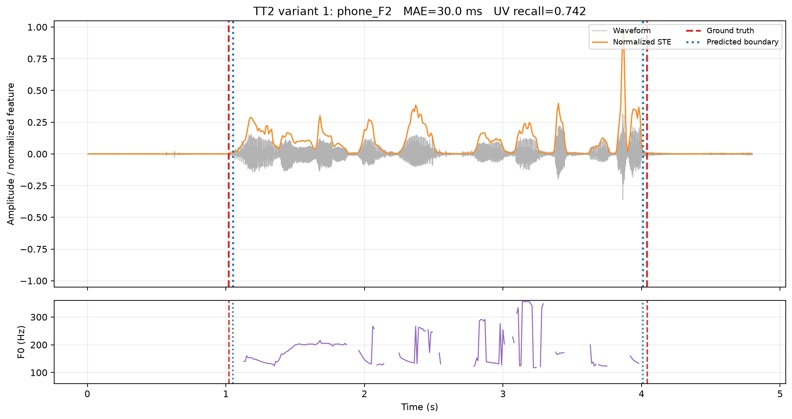
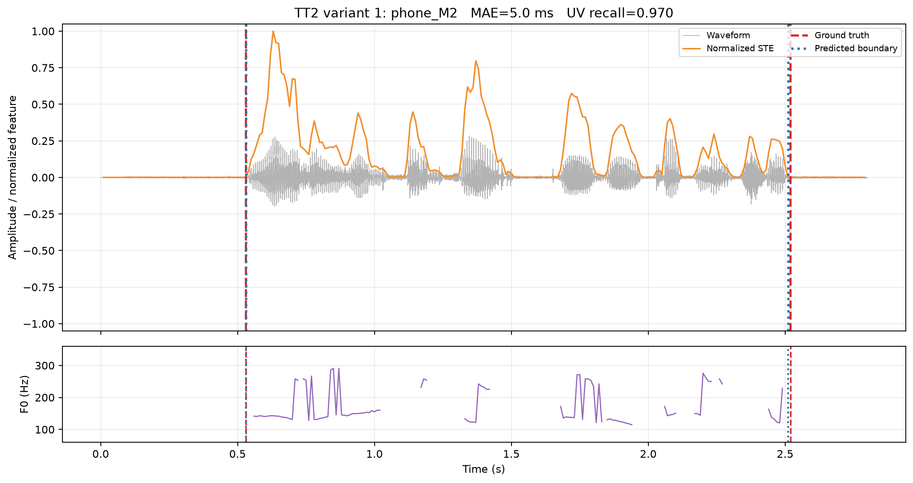
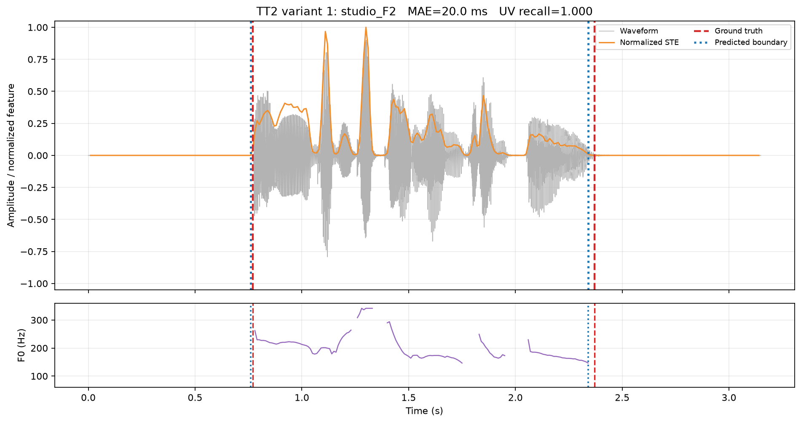
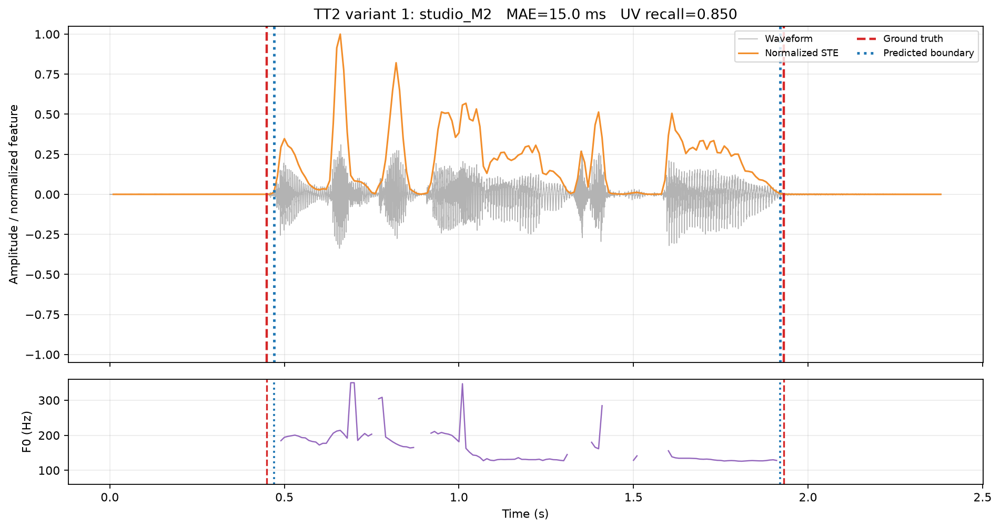

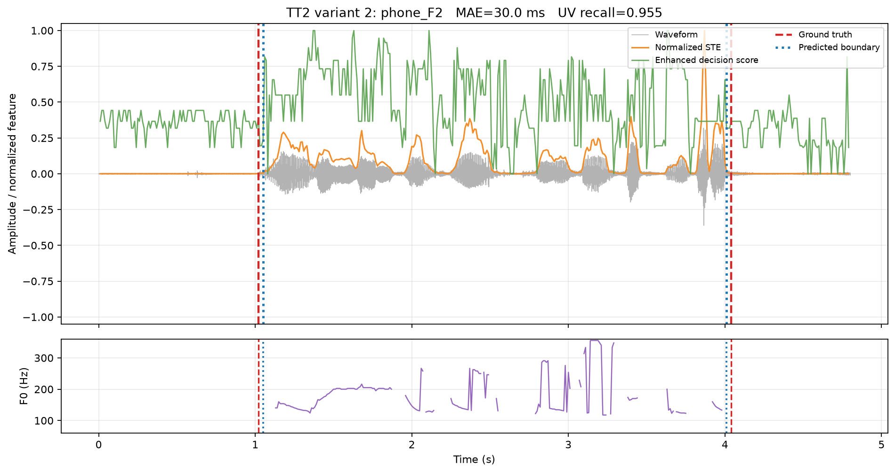
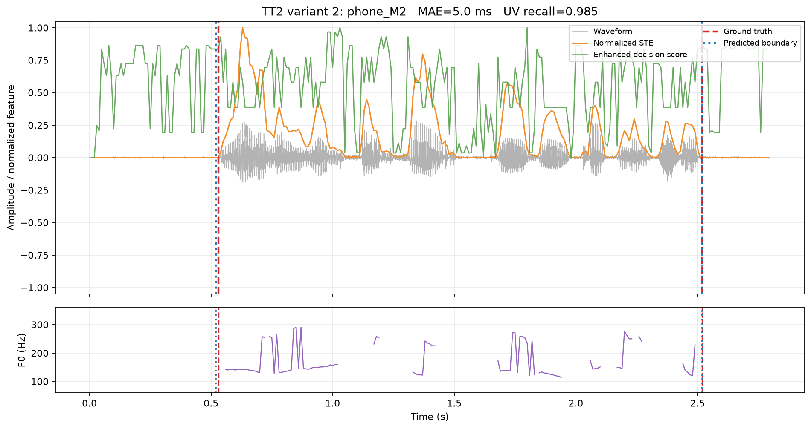
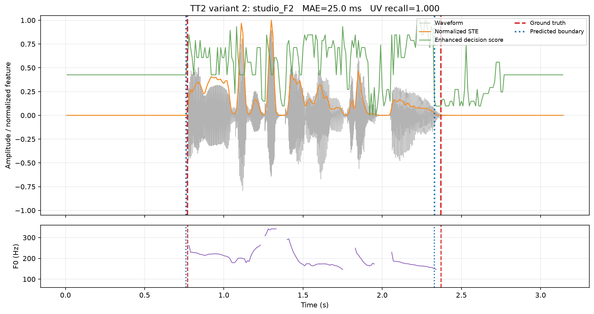
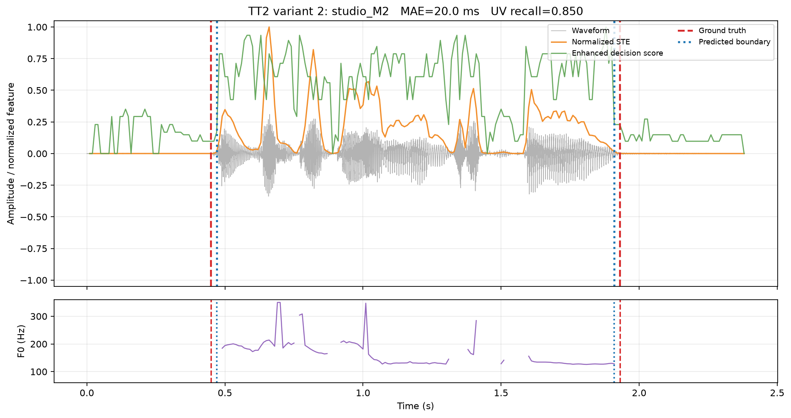

TT2 mở rộng tăng frame F1 từ 0.977 lên 0.988 và UV recall từ 0.891 lên 0.947. Nghĩa là nó giữ được nhiều frame unvoiced hơn. Tuy nhiên MAE biên tăng từ 17.50 ms lên 20.00 ms. Một vài biên ngoài bị dịch 1-3 hop dù vùng speech bên trong đầy đủ hơn.

Vì vậy không được kết luận TT2/2 tốt hơn hoàn toàn. Kết luận đúng là: **TT2/2 tốt hơn về bảo toàn âm vô thanh nhưng kém hơn một chút về vị trí hai biên ngoài**.

## 11. TT3 - mô hình Gaussian

### 11.1 TT3 cơ bản - `TT3/1.ipynb`

TT3 lấy tất cả frame training đã có nhãn rồi tách thành hai tập:

- silence STE: tính `mean_sil` và `std_sil`;
- speech STE: tính `mean_sp` và `std_sp`.

Mỗi lớp được giả sử tuân theo phân bố Gaussian. Ngưỡng nằm tại vị trí hai mật độ xác suất giao nhau. Frame ở một phía nghiêng về silence, phía còn lại nghiêng về speech.

Đây là phương pháp mang ý nghĩa thống kê rõ hơn ngưỡng cố định: tham số phải được suy ra từ dữ liệu training. Tuy nhiên STE của speech thường lệch mạnh và không thật sự Gaussian đối xứng, nên đây chỉ là mô hình xấp xỉ.

### 11.2 TT3 mở rộng - `TT3/2.ipynb`

Phần mở rộng thay một biến STE bằng vector bốn chiều gồm log-STE, năng lượng pre-emphasis, ZCR và high-frequency ratio. Mỗi lớp có mean vector và covariance matrix đầy đủ. Regularization được cộng vào đường chéo covariance để tránh ma trận gần suy biến.

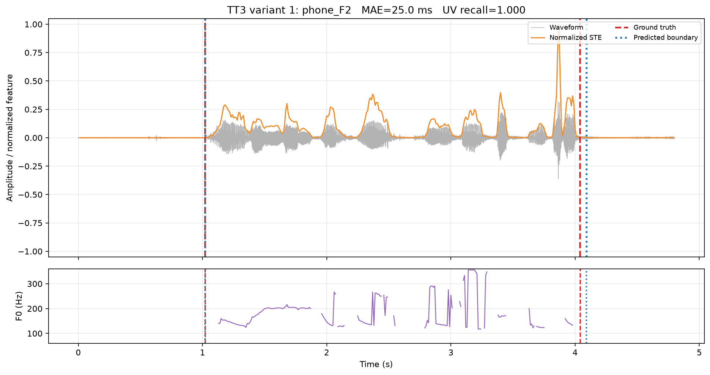
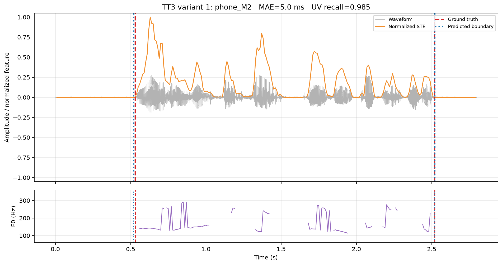

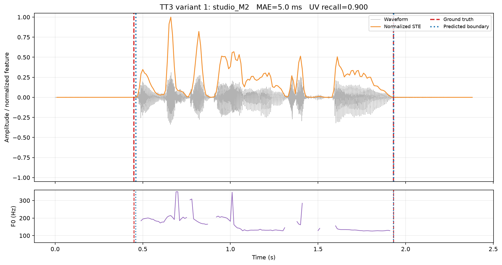

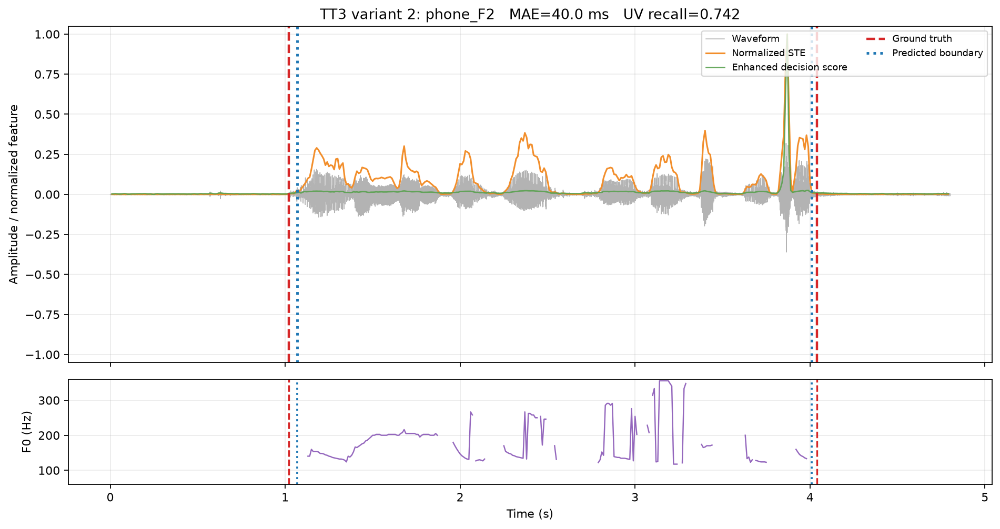
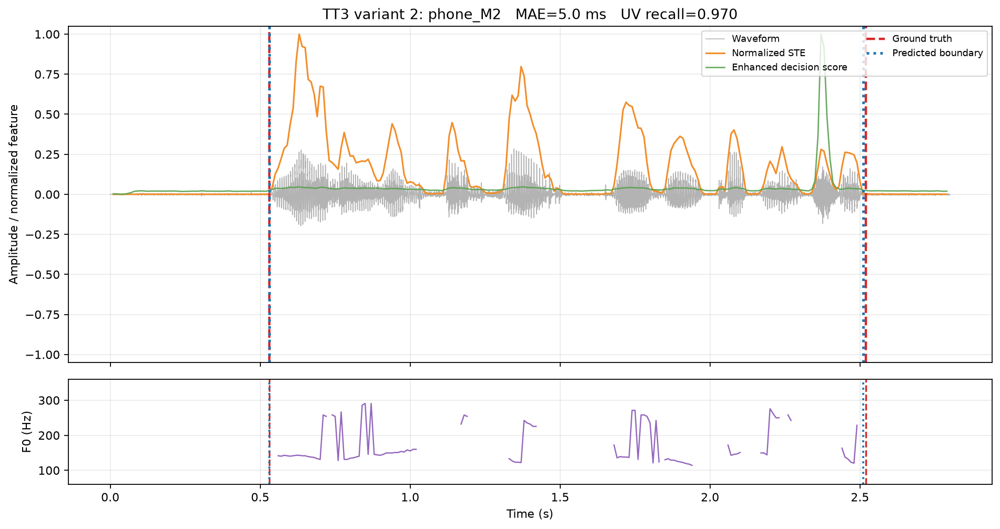
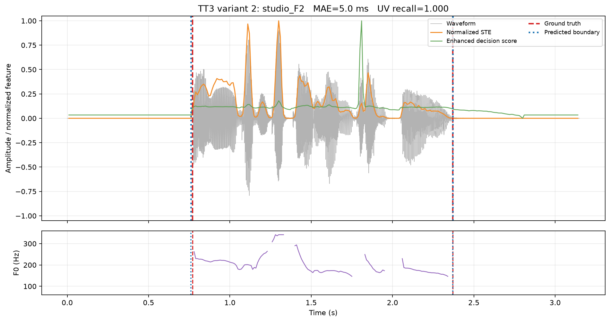
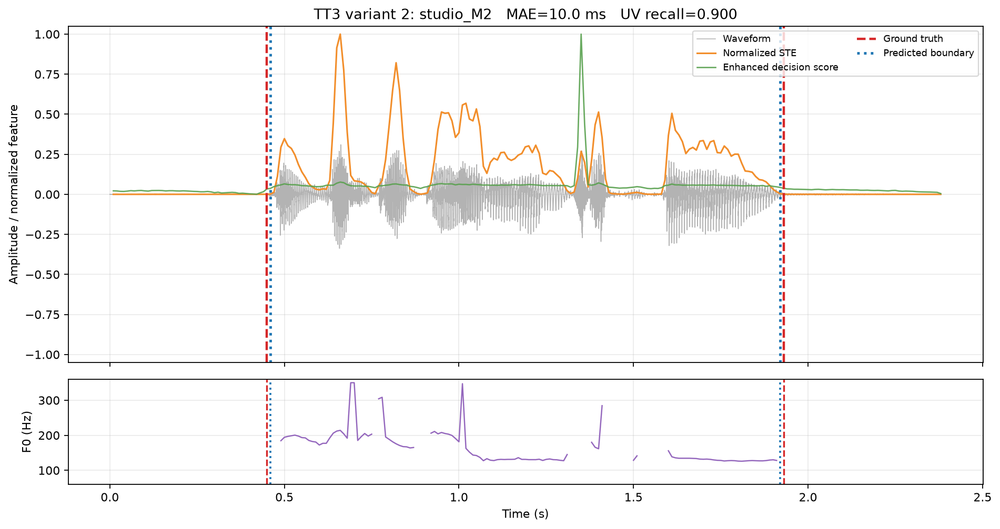

TT3 cơ bản đạt MAE 11.25 ms; bản đa biến đạt 15.00 ms. Bản phức tạp không thắng vì chỉ có bốn recording training, trong khi full covariance cần ước lượng nhiều tham số. Năng lượng một chiều đã phân tách khá tốt dữ liệu này. Đây là ví dụ cho thấy thêm feature và thêm tham số không tự động làm kết quả tốt hơn.

## 12. Đọc hình kết quả như thế nào?

Mỗi figure tương ứng một file test đầy đủ:

- vùng xám: waveform đầu vào;
- đường cam: normalized STE;
- đường xanh lá trong `2.ipynb`: decision score của phương pháp mở rộng, đã chuẩn hóa để dễ vẽ;
- hai đường đỏ nét đứt: ground-truth start/end từ LAB;
- hai đường xanh dương chấm: start/end do thuật toán tìm được;
- đường tím ở subplot dưới: F0 ước lượng.

Hai đường đỏ và xanh càng chồng lên nhau thì sai số biên càng nhỏ. Ví dụ, ground truth là `[1.02, 4.04]` còn dự đoán `[1.03, 4.04]` nghĩa là biên đầu trễ 10 ms và biên cuối đúng hoàn toàn.

Đường F0 thường xuất hiện thành các đoạn ở phần hữu thanh và bị đứt ở silence/unvoiced. Không nên hiểu đường F0 bị đứt là chương trình VAD chắc chắn dự đoán silence; F0 và VAD là hai thông tin khác nhau.

## 13. Các metric đánh giá

### 13.1 Boundary MAE

Với sai số biên đầu `e_start` và biên cuối `e_end`:

$$
MAE = (abs(e_start) + abs(e_end)) / 2
$$

MAE dễ hiểu và đúng trọng tâm đề. Ví dụ lệch đầu 10 ms, cuối 0 ms thì MAE bằng 5 ms.

### 13.2 Boundary RMSE

$$
RMSE = sqrt((e_start^2 + e_end^2) / 2)
$$

RMSE phạt lỗi lớn mạnh hơn MAE. Nếu một biên đúng nhưng biên kia sai rất xa, RMSE sẽ tăng rõ.

### 13.3 Frame F1

F1 đánh giá quyết định speech/silence trên toàn bộ các frame, không chỉ hai biên ngoài. Nó cân bằng precision và recall. F1 cao nghĩa là vùng speech tổng thể được bao phủ tốt và không nhận quá nhiều silence thành speech.

### 13.4 UV recall

UV recall là tỷ lệ frame có nhãn `uv` được giữ lại là speech. Metric này không nằm trong yêu cầu tối thiểu của đề nhưng cần thiết để kiểm tra điểm yếu của VAD chỉ dựa trên năng lượng.

## 14. Bảng kết quả hiện tại

| Phương pháp | MAE trung bình (ms) | RMSE trung bình (ms) | Frame F1 | UV recall |
|---|---:|---:|---:|---:|
| TT1/1 - global STE threshold | 8.75 | 11.34 | 0.993 | 0.971 |
| **TT1/2 - bộ đặc trưng DSP** | **6.25** | **7.80** | **0.996** | 0.968 |
| TT2/1 - histogram STE 1D | 17.50 | 18.81 | 0.977 | 0.891 |
| TT2/2 - histogram STE-ZCR 2D | 20.00 | 21.56 | 0.988 | **0.947** |
| TT3/1 - Gaussian STE 1D | 11.25 | 14.87 | 0.994 | **0.971** |
| TT3/2 - Gaussian đa biến | 15.00 | 16.34 | 0.978 | 0.903 |

Nếu chỉ xét đúng metric biên theo đề, thứ tự ba baseline cơ bản là:

1. TT1/1: 8.75 ms;
2. TT3/1: 11.25 ms;
3. TT2/1: 17.50 ms.

Nếu tính cả thí nghiệm mở rộng, TT1/2 tốt nhất với 6.25 ms.

## 15. So sánh quá trình từ main đến code hiện tại

Các số dưới đây được lấy bằng cách chạy trực tiếp từng nhánh, không lấy từ README cũ:

| Phiên bản | TT1 MAE | TT2 MAE | TT3 MAE |
|---|---:|---:|---:|
| `main` | 8.75 ms | 46.25 ms | 8.75 ms |
| `feature/improve-vad` | 8.75 ms | 18.75 ms | 11.25 ms |
| Code hiện tại - `1.ipynb` | 8.75 ms | **17.50 ms** | 11.25 ms |

TT2 là phần được sửa rõ nhất: MAE giảm từ 46.25 ms ở main xuống 18.75 ms ở feature và 17.50 ms ở notebook hiện tại.

TT3 main có số 8.75 ms vì dùng ngưỡng cố định 0.002864 trong pipeline test. Feature và notebook hiện tại tính ngưỡng động khoảng 0.001900 từ mean/std của training, đúng với yêu cầu “tham số lấy từ dữ liệu training” hơn nhưng MAE test là 11.25 ms. Vì vậy cần phân biệt **số đẹp trên bốn file test** và **quy trình phương pháp đúng yêu cầu**.

## 16. Vì sao mô hình phức tạp hơn có thể kém hơn?

Một phương pháp nhiều feature chỉ tốt hơn khi các feature cung cấp thông tin ổn định và có đủ dữ liệu để ước lượng tham số. Trong bài này chỉ có bốn file training:

- histogram 2D có nhiều bin bị ít mẫu;
- covariance đa biến có nhiều phần tử cần ước lượng;
- môi trường phone và studio có đặc tính khác nhau;
- normalization theo từng file có thể làm phân bố thay đổi.

Do đó variance của mô hình tăng và khả năng overfit lớn hơn. TT1/2 hoạt động tốt vì logistic boundary tương đối đơn giản. TT3/2 phức tạp hơn nhưng dữ liệu không đủ để covariance ổn định.

Kết luận chuyên môn đúng không phải “variant 2 luôn tốt hơn”, mà là:

> Đặc trưng voiced/unvoiced có ích khi giải quyết đúng failure mode của energy-only VAD, nhưng mức độ phức tạp phải phù hợp với kích thước dữ liệu.

## 17. Cách chạy và kiểm tra notebook

Thiết lập môi trường:

```powershell
uv sync
uv run jupyter lab
```

Mở một notebook rồi chọn **Restart Kernel and Run All Cells**. Mỗi notebook tự thực hiện:

1. import;
2. cấu hình frame và đường dẫn;
3. đọc WAV/LAB;
4. tạo list record và feature;
5. chia fit/validation/test;
6. định nghĩa class thuật toán;
7. fit và lưu history;
8. đánh giá MAE/RMSE/F1/UV recall;
9. hiển thị bốn figure;
10. lưu bốn PNG và `metrics.json` vào folder tương ứng.

Không còn source `.py` riêng. Sáu notebook đã được chạy kiểm tra, mỗi notebook có bốn ảnh inline và không có cell output lỗi.

## 18. Kết luận cuối cùng

Ba file `1.ipynb` là phần cơ bản bám yêu cầu giảng viên. Trong ba baseline, TT1 đạt sai số biên thấp nhất; TT2 thích nghi theo từng tín hiệu nhưng nhạy với hình dạng histogram; TT3 có cách xây dựng thống kê rõ ràng nhưng giả thiết Gaussian chỉ là xấp xỉ.

Các file `2.ipynb` kiểm tra ý tưởng bổ sung đặc trưng cho voiced/unvoiced. TT1/2 cho kết quả tốt nhất toàn bộ với MAE 6.25 ms. TT2/2 giữ unvoiced tốt hơn nhưng biên ngoài kém nhẹ. TT3/2 cho thấy full covariance không phù hợp khi chỉ có bốn recording training.

Điểm cần hiểu để bảo vệ bài không phải chỉ là đọc con số. Chuỗi xử lý cốt lõi là:

```text
input waveform -> framing -> DSP feature -> decision rule
-> 200 ms post-processing -> speech boundaries -> quantitative error
```

Đây chính là tư duy xử lý tín hiệu số: biến đổi tín hiệu đầu vào thành đặc trưng có ý nghĩa vật lý, dùng một quy tắc quyết định rõ ràng, rồi đánh giá output bằng ground truth và sai số định lượng.
